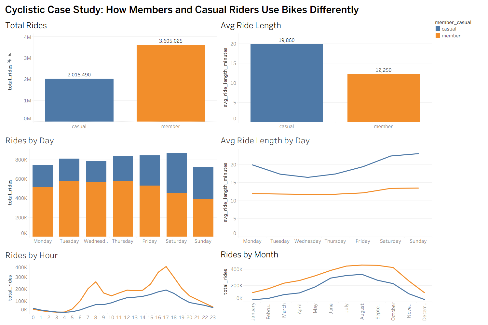

# Cyclistic Bike-Share Case Study

## Project Overview

This project analyzes how Cyclistic annual members and casual riders use the company’s bike-share service differently. The goal is to identify behavioral patterns that can help Cyclistic design marketing strategies to convert more casual riders into annual members.

The central business question is:

**How do annual members and casual riders use Cyclistic bikes differently?**

This project follows the case study structure defined in the Cyclistic prompt: business task, data sources, data cleaning, analysis, visualizations, and recommendations.

---

## Executive Summary

This case study examines how Cyclistic annual members and casual riders behave differently across ride frequency, ride duration, weekday patterns, hourly usage, and seasonality. Using twelve months of trip data from April 2025 to March 2026, the project identifies several clear differences between the two rider groups.

Annual members generated more rides overall, confirming that they are the core repeat-use segment of the service. Casual riders, however, took significantly longer rides on average, even after filtering extreme ride durations. Members showed stronger weekday and commute-like usage patterns, while casual riders were more active on weekends and during warmer months.

These findings suggest that Cyclistic should not position annual membership only as a commuting product. A stronger opportunity exists in targeting repeat casual users, especially those who ride frequently on weekends and during peak seasonal months, with messages focused on value, flexibility, and repeated leisure use.

---

## Business Task

Cyclistic wants to increase the number of annual memberships because annual members are more profitable than casual riders. To support that goal, this analysis compares annual members and casual riders across ride frequency, ride duration, time of use, and seasonality.

### Primary Question
How do annual members and casual riders use Cyclistic bikes differently?

### Stakeholders
- Lily Moreno, Director of Marketing
- Cyclistic Marketing Analytics Team
- Cyclistic Executive Team

### Why This Matters
The business problem is not simply to describe how the service is used. The real objective is to identify behavioral differences that can support conversion-focused marketing decisions. If Cyclistic understands when, how, and why casual riders behave differently from members, it can build more targeted strategies to convert them into annual subscribers.

---

## Data Source

The analysis uses Cyclistic historical bike trip data from the previous 12 months, based on the public Divvy trip dataset used in the case study.

### Scope Used in This Project
- Period covered: **April 2025 to March 2026**
- Source files: **12 monthly trip CSV files**
- Final cleaned dataset size: **5,620,515 rows**

### Data Characteristics
The dataset contains ride-level trip information, including:
- ride ID
- rideable type
- trip start timestamp
- trip end timestamp
- start station name and ID
- end station name and ID
- geographic coordinates
- rider type, either `member` or `casual`

### Important Data Limitations
- No personally identifiable customer information is available
- Trip purpose is inferred from behavioral patterns, not directly recorded
- No customer demographics or purchase history are available
- No campaign exposure or digital engagement data is included

Because of these limitations, this project focuses on descriptive behavioral analysis rather than causal modeling.

---

## Tools Used

- **Python**
- **Pandas**
- **SQLite**
- **DB Browser for SQLite**
- **Tableau**
- **GitHub**

### Why This Stack
- **Python** was used to combine and clean the monthly raw files
- **Pandas** was used for transformation, datetime processing, and feature engineering
- **SQLite** was used for structured analysis queries
- **DB Browser for SQLite** was used to inspect and run SQL queries
- **Tableau** was used to build the final dashboard
- **GitHub** was used to present the project in portfolio format

---

## Project Structure

```text
cyclistic-bike-share-case-study/
├── data/
│   ├── raw/
│   ├── cleaned/
│   └── summary/
├── docs/
│   ├── business_task.md
│   ├── case_study_report.md
│   ├── data_cleaning_log.md
│   └── presentation_notes.md
├── sql/
│   ├── 02_data_checks.sql
│   └── 03_analysis_queries.sql
├── src/
│   ├── data_cleaning.py
│   ├── check_clean_csv.py
│   ├── load_to_sqlite.py
│   ├── export_tableau_summary.py
│   └── export_tableau_summary_excel.py
├── visuals/
│   ├── charts/
│   └── dashboard/
├── README.md
├── requirements.txt
└── .gitignore
```text

---

## Data Cleaning and Preparation

The raw monthly trip files were combined and cleaned in Python before being loaded into SQLite for analysis.

### Main Cleaning Steps
- Imported 12 monthly trip CSV files
- Standardized column names
- Combined all monthly files into one dataset
- Converted `started_at` and `ended_at` to datetime format
- Created `ride_length_minutes`
- Created:
  - `day_of_week_num`
  - `day_of_week`
  - `month`
  - `month_name`
  - `hour`
  - `season`
- Removed rows with missing values in critical columns
- Removed duplicate `ride_id` values
- Removed zero and negative ride durations
- Standardized `member_casual` and `rideable_type`

### Cleaned Dataset Result
- Total rows: **5,620,515**
- Members: **3,605,025**
- Casual riders: **2,015,490**

### Outlier Handling
The cleaned dataset retained all positive ride lengths, but filtered ride-length analysis used rides between **1 and 1440 minutes** to reduce distortion from extremely short or extremely long trips.

This step was important because raw ride duration contained unrealistic short rides and very long rides that could distort averages. Rather than deleting them entirely from the cleaned dataset, the project used filtered comparisons where appropriate.

---

## Analysis Approach

The project compares annual members and casual riders across the following dimensions:

- Total ride volume
- Average ride duration
- Ride count by day of week
- Average ride length by day of week
- Ride count by hour
- Ride count by month
- Rideable type preference

The goal was not just to describe the data, but to identify differences that can support marketing decisions.

### Analytical Logic
The analysis was designed around one core principle: behavioral differences matter only if they can lead to business action. For that reason, the project focuses on patterns that can influence campaign timing, message framing, and user segmentation.

For example:
- If casual riders are most active on weekends, weekend campaigns may be more effective
- If casual riders take longer rides, messaging should emphasize value for repeated leisure use
- If casual usage rises in summer, campaign timing should follow demand rather than remain constant year-round

---

## Key Findings

### 1. Members generate more rides overall
- **Member rides:** 3,605,025
- **Casual rides:** 2,015,490

Annual members are clearly the core repeat-use segment of the service.

### 2. Casual riders take longer trips
Filtered average ride length:
- **Casual:** 19.86 minutes
- **Member:** 12.25 minutes

Even after filtering extreme ride lengths, casual riders still ride much longer than members.

### 3. Members are stronger on weekdays, casual riders are stronger on weekends
Casual riders increase sharply from Friday onward and peak on Saturday. Member rides are more concentrated during weekdays.

This supports the idea that members behave more like routine transportation users, while casual riders behave more like leisure users.

### 4. Casual riders also ride longer on weekends
Filtered average ride length by day shows that casual rider trip duration rises further on Saturday and Sunday, while member ride length stays relatively stable.

### 5. Member hourly behavior looks like commuting
Members show strong ride peaks in the morning and late afternoon, especially around:
- 08:00
- 16:00
- 17:00
- 18:00

Casual riders are more spread across the day and show a more leisure-oriented timing pattern.

### 6. Casual demand rises sharply in warmer months
Casual usage grows strongly from spring into summer and peaks in the warmer part of the year. This suggests that conversion opportunities are not evenly distributed across the calendar.

### 7. Electric bikes dominate usage in both segments
Both rider groups use electric bikes more than classic bikes, which suggests that convenience and ease matter across the board.

---

## Interpretation of Findings

The results point to a clear behavioral split between rider segments.

Annual members behave like routine, repeat transportation users. Their usage is denser on weekdays and concentrated in morning and post-work hours, which strongly suggests commuting or regular mobility patterns.

Casual riders behave differently. Their trips are longer, their activity rises on weekends, and their demand expands significantly in warmer months. This pattern is much more consistent with leisure, recreation, or spontaneous city use.

This distinction matters because a marketing message built for commuter conversion may miss the actual motivations of casual riders. The project therefore argues that membership should not be positioned only as a workday mobility product.

---

## Business Insights

### Insight 1
Annual members use Cyclistic more frequently, but casual riders use it for longer trips.

### Insight 2
Members show a weekday and commute-like usage pattern, while casual riders peak on weekends.

### Insight 3
Casual rider activity rises strongly in warmer months, making spring and summer the highest-potential periods for conversion campaigns.

### Insight 4
Weekend casual behavior is different in both volume and trip duration, suggesting that repeat weekend riders are a strong conversion opportunity.

### Insight 5
The strongest message for casual conversion is likely value for repeated leisure use, not just commute convenience.

---

## Recommendations

### 1. Build weekend-focused conversion campaigns
Casual riders are especially active on Fridays, Saturdays, and Sundays, and their weekend ride durations are longer. Cyclistic should target these users with membership offers positioned around better value for frequent city rides and repeated leisure use.

**Why this matters:**  
This aligns the message with the observed behavior of the target segment rather than forcing commuter-style positioning.

### 2. Concentrate conversion efforts in peak seasonal months
Casual rider demand rises strongly from late spring through summer. Cyclistic should increase membership promotion intensity during these high-engagement months rather than spreading effort evenly across the year.

**Why this matters:**  
Campaign efficiency should follow demand. Reaching casual riders during their highest-activity periods increases the chance of conversion.

### 3. Position membership as a value product for repeat leisure use, not only commuting
The data suggests that casual riders do not behave like members. Membership should therefore be framed not only as a commuter product, but also as a smart option for regular city exploration, weekend rides, and flexible everyday movement.

**Why this matters:**  
A positioning mismatch weakens conversion. The product should be marketed in the language of the actual target behavior.

### 4. Explore winter casual riders as a potential high-conversion segment
A possible next-step analysis would isolate casual riders who remain active in lower-demand months. These users may behave less like occasional tourists and more like recurring transportation users.

**Why this matters:**  
Not all casual riders are equally valuable. A more targeted conversion strategy could outperform a broad one.

---

## Tableau Dashboard

The final dashboard compares annual members and casual riders across ride volume, ride duration, weekday behavior, hourly behavior, and seasonality.

**Dashboard title:**  
Cyclistic Case Study: How Members and Casual Riders Use Bikes Differently



### Dashboard Purpose
The dashboard is designed to support quick executive understanding. Instead of showing all possible statistics, it focuses on the patterns most relevant to membership conversion:
- who rides more
- who rides longer
- when each group rides
- how usage changes across the week
- how demand changes across the year

---

## Files Created in This Project

### Python scripts
- `src/data_cleaning.py`
- `src/check_clean_csv.py`
- `src/load_to_sqlite.py`
- `src/export_tableau_summary.py`
- `src/export_tableau_summary_excel.py`

### SQL files
- `sql/02_data_checks.sql`
- `sql/03_analysis_queries.sql`

### Documentation
- `docs/business_task.md`
- `docs/data_cleaning_log.md`
- `docs/case_study_report.md`
- `docs/presentation_notes.md`

### Visual Outputs
- Tableau dashboard screenshot
- exported summary sheets for visualization
- optional chart images for GitHub presentation

---

## How to Reproduce the Project

### 1. Place the monthly trip CSV files in:
`data/raw/`

### 2. Run the cleaning script
`python src/data_cleaning.py`

### 3. Check the cleaned CSV
`python src/check_clean_csv.py`

### 4. Load cleaned data into SQLite
`python src/load_to_sqlite.py`

### 5. Run SQL analysis
Use DB Browser for SQLite and run:
•	`sql/02_data_checks.sql`
•	`sql/03_analysis_queries.sql`

### 6. Export Tableau summary files
`python src/export_tableau_summary.py`
`python src/export_tableau_summary_excel.py`

### 7. Build the dashboard in Tableau
`data/summary/tableau_summary.xlsx`

---

## Limitations
•	No customer-level identity data is available
•	Trip purpose is inferred, not directly observed
•	No demographic data is included
•	No campaign exposure data is available
•	Ride-length outliers required filtered analysis for cleaner comparison
These limitations mean the project is strong for descriptive insight and strategy support, but it does not prove causation.

---

## Future Improvements
Potential next steps:
•	add station-level analysis to compare tourist and business-area usage
•	isolate winter casual riders as a high-potential conversion segment
•	compare one-time casual riders with repeat casual riders
•	test campaign ideas with additional customer engagement data
•	build a conversion likelihood model

---

## Portfolio Value
This project demonstrates the ability to:
•	translate a business question into an analytical workflow
•	clean and structure large operational datasets
•	perform SQL-based behavioral analysis
•	handle outliers appropriately
•	create stakeholder-facing visualizations
•	turn analysis into actionable recommendations

---

## Author
Emir Polat
Architecture and design background transitioning into data analytics and data science through practical case studies, portfolio projects, and public learning.

